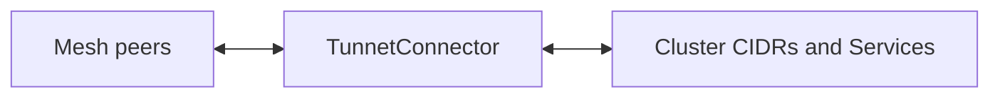

# Kubernetes

Connect a Kubernetes cluster to your Tunnet mesh with the Tunnet Operator. Pods and Services become reachable from any enrolled machine, and you can expose cluster apps to the mesh or the public internet using the same Tunnet products you already know — Serve and Tunnel.

## What you get

- **Cluster on the mesh** — A connector node joins your network and can advertise cluster CIDRs as [subnet routes](/products/mesh/subnet-routes).
- **Mesh-native services** — Publish a Kubernetes Service to peers with [Serve](/products/serve/) (`TunnetIngress`).
- **Public HTTPS** — Give a Service a public URL with [Tunnel](/products/tunnel/) (`TunnetTunnel`).
- **Reach mesh from the cluster** — Call a mesh hostname or IP from inside the cluster (`TunnetEgress`).
- **Optional sidecars** — Inject a Tunnet sidecar into selected pods so those workloads join the mesh directly.
- **Dashboard visibility** — Connectors and proxies show up under **Kubernetes** in the Tunnet dashboard.

## How it fits

You keep deploying apps with Deployments, Services, and Ingress as usual. The operator adds Tunnet-specific resources next to them. Once a connector is Ready, other mesh peers can reach advertised CIDRs; once an ingress or tunnel is Ready, peers (or the public internet) can reach that Service through Tunnet.

## Prerequisites

- A Tunnet **managed** organization and network ([Quick Start](/guide/quickstart-managed))
- An **API key** for the organization (Dashboard → Organization → API keys). Prefer **Manage SDK / K8s nodes** so the operator can clean up nodes when you delete resources.
- `kubectl` access to the target cluster
- Helm 3

## Guides in this section

1. [Install the operator](/integrations/kubernetes/install) — Helm chart, credentials, and verification
2. [Connect a cluster](/integrations/kubernetes/connector) — `TunnetConnector` and subnet routes
3. [Expose services](/integrations/kubernetes/expose-services) — Ingress, Tunnel, and Egress CRDs
4. [Dashboard](/integrations/kubernetes/dashboard) — What to expect in the UI

## Resource overview

| Resource | Scope | Purpose |
| --- | --- | --- |
| `TunnetConnector` | Cluster | Joins the mesh and advertises subnet routes |
| `TunnetIngress` | Namespaced | Serves a Kubernetes Service on the mesh |
| `TunnetTunnel` | Namespaced | Publishes a Service via a Tunnet tunnel |
| `TunnetEgress` | Namespaced | Lets cluster workloads call a mesh peer |
| `TunnetProxyGroup` / `TunnetProxyClass` | Cluster | Optional pooling and pod defaults for proxies |

Short names: `tnc`, `tni`, `tnt`, `tne`, `tnpg`, `tnpc`.
