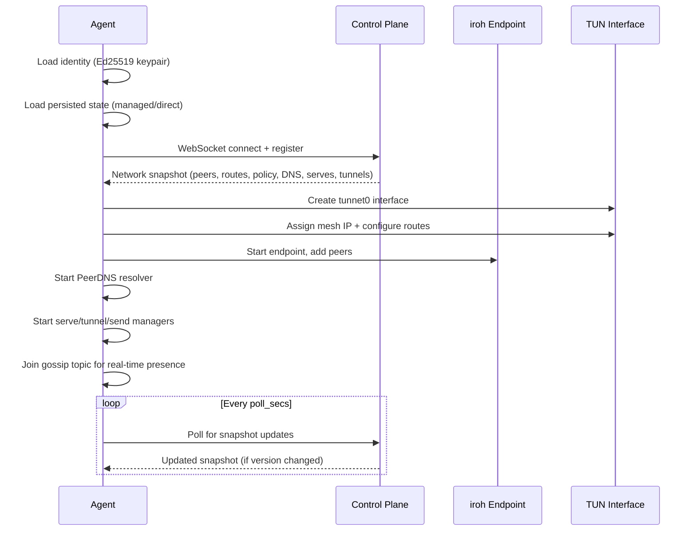

# How Mesh Works

When you run `tunnet run`, the agent performs the following sequence.

## Startup flow

## Packet flow

When an application on Machine A sends a packet to Machine B's mesh IP (say 10.7.0.5):

The packet enters the `tunnet0` TUN interface. The agent reads it, checks the destination IP against the routing table, and finds the peer with that mesh IP. It checks the ACL policy - if denied, the packet is dropped. If allowed, it sends the packet as a QUIC datagram to the peer's iroh endpoint. On Machine B, the iroh endpoint receives the datagram, and the agent writes it to Machine B's TUN interface. The OS network stack on Machine B delivers it to the target application.

For subnet routes, the process is similar but the gateway peer receives the packet and forwards it to the actual LAN destination.

## Configuration sync

The control plane maintains a versioned snapshot for each endpoint. When something changes - a peer joins, a policy is updated, a tunnel is created - the snapshot version increments. Agents detect the new version via WebSocket notification or periodic polling, fetch the updated snapshot, and apply the changes (add/remove peers, update routes, reconfigure DNS, start/stop serves and tunnels).
