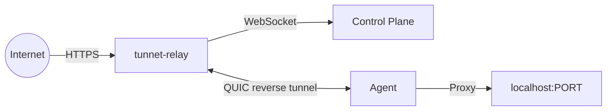

# Relay

The Tunnet relay (`tunnet-relay`) is a self-hosted edge server that terminates public tunnels. Agents establish reverse tunnels to the relay, and the relay accepts public HTTPS (and TCP) connections and forwards them to the appropriate agent.

## How it competes

The relay competes with **Cloudflare Tunnel's edge network** and **ngrok's infrastructure**. The difference is that you own and operate the relay servers. You control the DNS, the certificates, the geographic placement, and the capacity.

## Architecture

The relay registers itself with the control plane via WebSocket. When a tunnel is created, the control plane assigns it to a relay and provides the agent with the relay address and auth token. The agent establishes a reverse QUIC connection to the relay. Public traffic arrives at the relay and is forwarded through this reverse connection.
