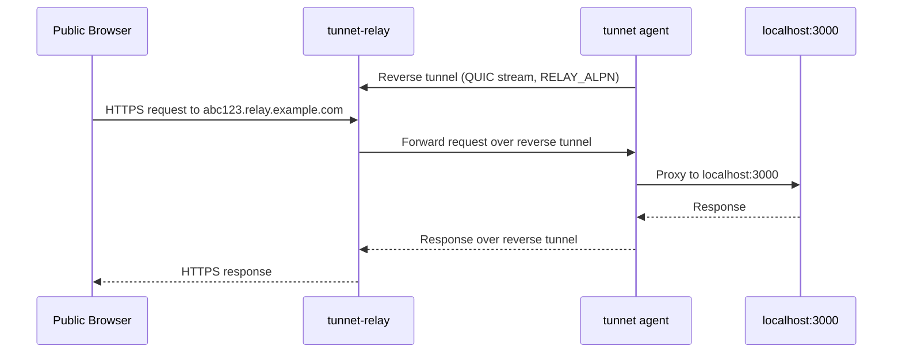

# Tunnel

`tunnet tunnel` gives a local port a public HTTPS URL through a Tunnet relay. The URL is reachable from the public internet, but the traffic flows through the relay to your agent - no inbound firewall rules needed.

## How it competes

Tunnel competes directly with **ngrok** (public tunnels to local services), **Cloudflare Tunnel** (exposing internal services to the internet), and **Tailscale Funnel** (public access to tailnet services). Tunnet's advantage is self-hosted relay infrastructure and integration with the mesh network.

## Quick start

```bash
# Expose port 3000 to the internet
tunnet tunnel 3000

# Check active tunnels
tunnet tunnel status

# Stop the tunnel
tunnet tunnel off 3000
```

The CLI outputs a public URL like `https://abc123.your-relay.example.com` that anyone can access.

## How it works



When you create a tunnel, the agent establishes a persistent reverse tunnel to the assigned relay. The relay terminates public HTTPS and forwards incoming requests to the agent through the reverse tunnel. The agent proxies the request to your local service.

## Dashboard management

Tunnels can also be created from the dashboard. Navigate to **Tunnels** to see all active tunnels and create new ones. The tunnel detail page provides controls for path-based redirects and TCP port mappings.
